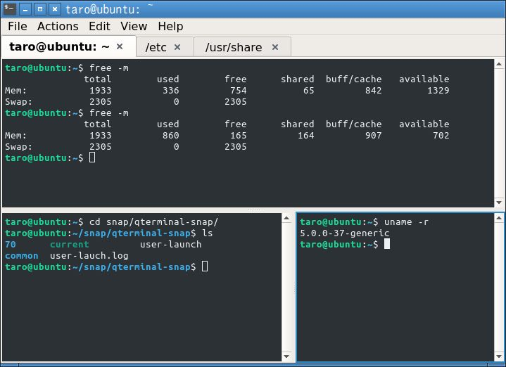

Qterminalの Snapパッケージを公開しています。非公式なパッケージです。

開発中の最新版を使用できるように、Snapパッケージ化しました。

「Qterminal」は LXQtプロジェクトが開発している ターミナルエミュレーターです。
ドロップダウン式ターミナルとしても使用できます。
日本語表示にも対応しています。

## インストール

GUIの ソフトウエアセンター(gnome-software)やスナップストア(snap-store)や KDE Discover からもインストールできます。

]

※既にQterminal(debやrpm等)がインストールされていても Snap版をインストール可能です。
設定内容は別々に保存されます。

## 既知の問題

* バージョン番号が「0.14.1」と表示される。実際は開発中の最新の状態です。
